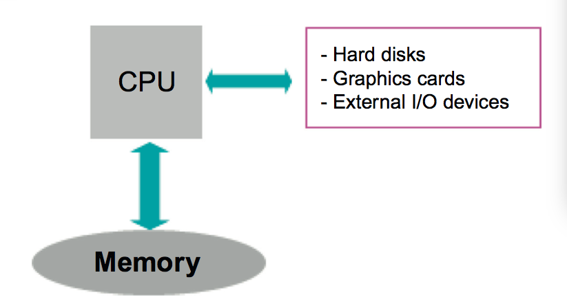
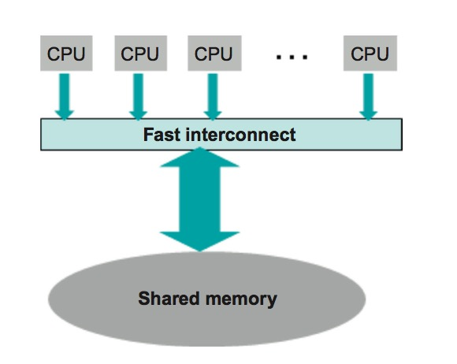
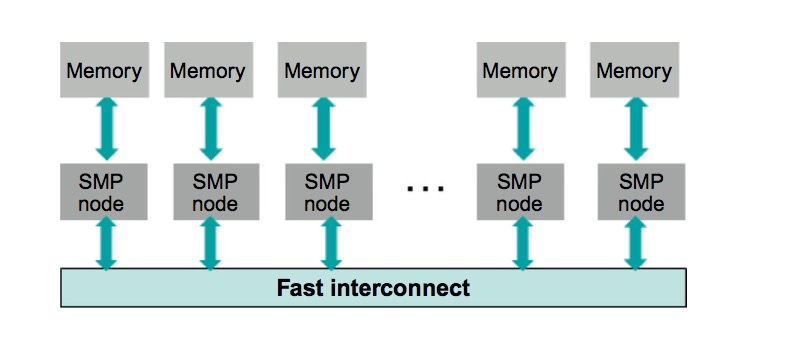
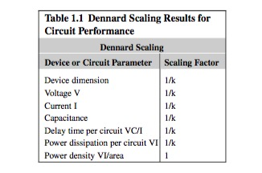
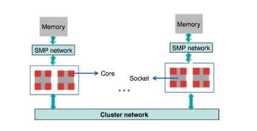

# 第一章 概述

---

## 1.1 进程与线程

Multithreading is today a @@mandatory@@ software technology for taking full advantage of the capabilities of modern computing platforms of any kind, and a good understanding of the overall role and impact of threads, as well as the place they take in the computational landscape, is useful before embarking on a detailed discussion of this subject.

多线程在当今已经是一个必要的软件开发技术，充分利用各种现代计算平台的计算能力，并很好的理解线程的整体作用和影响，以及用于的场景。非常有必要的详细的介绍。

We are all @@permanently@@ running standalone applications in all kinds of computing devices: servers, @@laptops@@, smartphones, or multimedia devices. All the data processing devices available in our environment have a master piece of software—the operating system (OS)—that controls and manages the device, running different applications at the user’s demands. A standalone application corresponds to a process run by the operating system. A process can be seen as a black box that owns a number of protected hardware and software resources; namely, a block of memory, files to read and write data, network connections to communicate eventually with other processes or devices, and, last but not least, code in the form of a list of instructions to be executed. Process resources are protected in the sense that no other process running on the same platform can access and use them. A process has also access to one or several central processing units—called CPU for short—providing the computing cycles needed to execute the application code.

我们在各种计算设备上持久独立的运行应用程序：服务器、笔记本电脑、智能手机或者多媒体设备。在我们可用的数据处理设备的环境中有一个重要组成部分软件操作系统- 既控制和管理设备的软件，通过用户的指令运行的不同的应用程序。一个独立的应用程序在操作系统中和一个进程一一对应。一个进程可以被看作是一个黑盒子拥有一定的软件硬件资源。换句话就是一些内存、文件去读写数据、网络连接去和其他的进程或设备交互以及代码以一系列指令的形式执行。进程资源是受保护的，同一平台的其他进程是无法访问及使用的。一个进程可以访问一个或多个中央处理单元简称中央处理器提供执行应用程序执行所需的计算周期

One of the most basic concepts we will be using is the notion of concurrency, which is about two or more activities happening at the same time. Concurrency is a natural part of life: we all can, for example, walk and talk at the same time. In computing platforms, we speak of concurrency when several different activities can advance and make progress at the same time, rather than one after the other. This is possible because CPU cycles are not necessarily @@exclusively@@ owned by one individual process. The OS can allocate CPU cycles to several different processes at the same time (a very common situation in general). It allocates, for example, @@successive@@ time slices on a given CPU to different processes, thereby providing the @@illusion@@ that the processes are running simultaneously. This is called multitasking. In this case, processes are not really running simultaneously but, at a human time scale, they advance together, which is why it is appropriate to speak about concurrent execution.

我们将介绍最基本的概念之一并发，就是在同一时间同时操作两个或更多的事件。并发在生活中也很常见：例如我们可以同时说话和走路。在计算平台中，不同的活动事件可以运行并且给出进度在同一时间，而不是一前一后的执行，我们称为并发。在一个独立的进程中不一定拥有唯一的计算周期。操作系统会分配CPU计算周期给不同的进程。系统分配计算周期是讲CPU计算周期切分成多个连续的时间分配给不同的进程。感觉所有的进程在同时执行，称为多任务。进程其实不是真正的同时运行，只是人为感觉值在同时执行，这也就是为什么称为值并发执行的原因。

One special case of concurrency happens when there are sufficient CPU resources so that they do not need to be shared: each activity has exclusive ownership of the CPU resource it needs. In this optimal case, we may speak of parallel execution. But remember that parallel execution is just a special case of concurrency.

一个特殊的并发是在不需要共享CPU资源的情况下：每个活动都关联一个唯一的CPU资源，在最佳的情况下我们称为并行执行。但是并行执行只是并发的一种特殊情况

As stated, a process incorporates a list of instructions to be executed by the CPU. An ordinary sequential application consists of a single thread of execution, i.e., a single list of instructions that are bound to be executed on a single CPU. In a C-C++ programming environment, this single thread of execution is coded in the main() function. In a multithreaded application, a process integrates several independent lists of instructions that execute asynchronously on one or several CPU. Chapter 3 shows in detail how the different multithreading programming environments allow the initial main thread to install other execution streams, equivalent to main() but totally disconnected from it. Obviously, multithreading is focused on enhancing the process performance, either by @@isolating@@ independent tasks that can be executed concurrently by different threads, or by activating several CPUs to share the work needed to perform a given parallel task.

正如，一个进程执行一些列的指令，一个普通的顺序执行应用程序由一个执行线程组成, 例如，单个一个指令列表在一个CPU上执行,在C/C++开发环境中单个线程执行 main() 函数。在多线程应用程序中，一个进程集成了多个指令列表分别异步的在一个或多个CPU上执行。第三章详细的介绍在不同的多线程环境中开发在主线程中初始化其他执行流。和 main() 函数类似但是独立于它。显然多线程主要是为了提升进程的性能，通过隔离独立的任务并行的在多个线程中执行，或者在支持并行任务的平台上通过几个处理器共享执行指令任务

---

## 1.2 计算平台概述

A computing platform consists essentially of one or more CPUs and a memory block where the application data and code are stored. There are also peripheral devices to communicate with the external world, like DVD drives, hard disks, graphic cards, or network interfaces.

一个计算平台必需由一个或多个 CPU 、用来存储应用程序的数据和代码的内存组成。还有外围设备和外界通信，如 DVD 光驱、硬盘、显卡、网卡等。

Figure 1.1 shows a schematic view of a personal computer. For the time being, think of the processor chip as corresponding to a single CPU, which used to be the case until the advent of the multicore evolution, circa 2004, when processor chips started to integrate several CPUs. The data processing performance of the simple platform shown in Figure 1.1 depends basically on the performance of the CPU, i.e., the rate at which the CPU is able to execute the basic instructions of the instruction set. But it also depends critically on the rate at which data can be moved to and from the memory: a fast processor is useless if it has no data to work upon.

如图 1.1 所示是一个个人计算机的示意图. 随着时间的推移，处理芯片有一对一的单个CPU，大约在 2004 年多核演化到来处理芯片可以集成多颗 CPU. 如图 1.1 所示的简单平台的数据处理性能依赖于基础的CPU计算性能。如 CPU 执行指令集中基础指令的速率。但是也依赖从内存中移动数据的速率：一个快速的处理器是没有用的如果没有数据处理



The rate at which the CPU is able to execute basic instructions is determined by the internal processor clock speed. Typically, the execution of a basic low-level instruction may take up to a few cycles, depending on the instruction complexity. The clock frequency is directly related to the peak performance, which is the theoretical performance in an ideal context in which processor cycles are not wasted. The original Intel 8086 processor in the late 70 s ran at 5 MHz (i.e., 5 millions of cycles per second). Today, processors run at about 3 GHz (3000 millions of cycles per second). This represents a 600× increase in frequency, achieved in just over 20 years.

CPU 处理基础指令的速度由处理器内部的时钟速度决定。典型饿一个底层指令需要几个时钟周期，依赖指令的复杂度。时钟频率直接和性能峰值相关，性能峰值是处理器在理想情况下没有任何消耗的理论性能。在 70 年代后期 Intel 8086 处理器的速度是 5MHz (每秒 500万个时钟周期)。如今，一个处理器可以跑到 3GHz(每秒30亿个时钟周期). 20多年频率增加了600多倍。

Memory performance is a completely different issue. The time T needed to move to or from memory a data block of N bytes is given by:

内存性能是完全不同的问题，时间T 是在内存中移动 N 个字节的数据需要的时间：

**T = L + N/B**

where L is the latency, namely, the access time needed to trigger the transfer, and B is the bandwidth, namely, the speed at which data is moved once the transfer has started.

其中 L 是延迟时间，意思是从出发到传输需要的时间，B 是带宽，传输数据的速度

It is important to keep in mind that, in the case we are considering, moving data from memory to the processor or vice versa:

需要注意的是，目前考虑的是数据从内存到处理器间的传输，反之亦然：

- The bandwidth is a property of the network connecting the two devices. Bandwidths are controlled by network technologies.
- The latency is an @@intrinsic@@ property of the memory device.

- 带宽是连接两个设备的网络连接的一个属性，带宽是由网络技术控制
- 延迟是内存设备的固有属性

It turns out that memory latencies are very difficult to tame. At the time of the 8086, memory latencies were close to the processor clock, so it was possible to feed the processor at a rate guaranteeing roughly the execution of one instruction per clock cycle. But memory latencies have not decreased as @@dramatically@@ as processor frequencies have increased. Today, it takes a few hundreds of clock cycles to trigger a memory access. Therefore, in ordinary memory bound applications the processors tend to @@starve@@, and typically their @@sustained@@ performances are a small fraction (about 10%) of the theoretical peak performance promised by the processor frequency. As we will see again and again, this is the @@crucial@@ issue for application performance, and lots of @@ingenuity@@ in the design of hardware and system software has gone into taming this bottleneck, which is called the memory wall.

事实证明，内存延迟是非常难克服的，在 8086 时期，内存延迟接近于处理器时钟，所以可以保证处理的速度处理一个指令每个时钟周期。但是内存延迟没有随着处理器频率的增加而减少。如今需要几百个时钟周期才可以出发一次内存访问。然而一般的内存瓶颈的应用程序会使 CPU 饿死, CPU 使用率都大约是理论的性能峰值的 10% 左右。正如我们所看到的这正是应用程序性能的关键问题，很多硬件和软件在设计的时候已经克服了该瓶颈，被称为 memory wall.

### 1.2.1 多核内存共享系统

The next step in computing platform complexity are the so-called symmetric multiprocessor (SMP) systems, where a network interconnect links a number of processor chips to a common, shared memory block. Symmetric means that all CPUs have an equivalent status with respect to memory accesses. Memory is shared, and all CPUs can access the whole common memory address space. They are shown in Figure 1.2.

下一步比较复杂的计算平台称为对称多处理系统(SMP), 网络互连多个处理芯片共享一个内存块。对称意思是访问内存的地位是相当的，内存是共享的多个CPU可以访问整个内存地址空间。如图 1.2 所示



For reasons that will be discussed in Chapter 7, @@coherency@@ in shared memory accesses prevents SMP platforms from scaling to very large numbers of CPUs. Today, shared memory systems do not @@exceed@@ 60 CPUs. This limit will perhaps increase in the future, but it is bound to remain limited. These systems are very useful as medium-size servers. They can @@perform@@ efficient multitasking by allocating different applications on different CPUs. On the other hand, a multithreaded application can benefit from the availability of a reasonable number of CPUs to enhance the process performance.

由于内存共享访问一致性问题限制了SMP平台CPU的数量，将在第七章详细讨论。如今内存共享系统的 CPU个数不超过 60个。这个限制个数可能在未来会增加，但是依然会有限制。这些系统在中型的服务器中非常有用。可以高效的执行多任务将不同的应用程序分配到不同的 CPU. 另一方面，对于一个多线程应用程序当 CPU 数量在一个合理的范围时有利于提升性能

However, note that the SMP computing platforms are not perfectly symmetric. The reason is that a huge, logically shared memory block is normally constructed by using, say, M @@identical@@ memory devices. Therefore, the SMP network interconnect is really connecting all N processor chips to all M memory blocks. According to the topology and the quality of the network, a given CPU may not be at the same “effective distance” of all M memory blocks, and the access times may be non- uniform with mild differences in memory access performance. This kind of computing platform is called a NUMA (Non-Uniform Memory Access) architecture. This observation is sometimes relevant in multithreaded programming, because performance may be optimized by placing data items as close as possible to the CPU running the thread that is accessing them. This issue—placing threads as near as possible to the data they access—is called memory affinity. It plays a significant role in multithreaded programming.

然而，SMP 计算平台也不是完全的对称。由于的大的原因是，逻辑上内存共享就是正常的在使用的构建，交互，M 是完全相同的内存设备, 因此，SMP 网络内连接其实是N个处理器连接 M 个内存块。根据网络拓扑图和网络质量，一个 CPU 访问多个内存块不能每个距离都相等，访问内存的时间是非均匀的。这种计算平台叫做 NUMA (非均匀内存访问) 结构。这个观点有事和多线程开发相关，离处理线程近的访问内存消耗的时间相对会少，有利于提升性能。这个问题使线程尽可能接近它们所访问的数据被称为内存的亲和力。它在多线程编程中起着重要的作用。

### 1.2.2 分布式内存多处理器系统

The only way to move beyond SMPs to large massive parallel computers is to abandon the shared memory architecture and move to a distributed memory systems, as shown in Figure 1.3. These platforms are essentially clusters of SMPs; namely, a collection of SMP computing platforms linked by yet another, higher level network interconnect. Each SMP has its own private memory address space. When running a huge parallel application that engages several SMP nodes, CPUs in different SMP nodes communicate by explicit message-passing protocols.

超越 SMP 做大量并行计算的唯一的方式就是放弃内存共享结构，采用分布式内存系统。如图 1.3 所示。这些平台组建 SMP 集群是必不可少的。换句话说就是一些 SMP 计算平台用更高级的网络连接起来。每个SMP 都有自己私有的内存访问空间。运行一个巨大的并行应用在多个SMP节点上，CPU在不同的SMP节点消息传递通过协议通信。



The quality of these platforms as parallel platforms depends essentially on the quality of the network interconnect. Standard clusters integrate commodity networks, while more ambitious supercomputers tuned for extreme massive parallelism—like the IBM BlueGene systems—incorporate proprietary networks that support highly optimized point-to-point and collective communication operations. There is no limit to the scalability of these systems other than those arising from network performance. Today, systems incorporating several hundred thousands of CPUs are in operation.


这些平台最为并行计算平台的质量取决于网络连接的质量。标准的集群整合商业网络，而更加雄心勃勃的超级计算机已经变成了极端的大规模并行处理，比如，IBM 的 BlueGene 采用的专用网络支持点对点高度优化和集群内通信操作。除了那些从网络性能所产生的这些系统的可扩展性没有限制。当今，将数十万系统CPU在运行。

Large parallel applications consist of independent processes running on different SMPs and communicating with one another via an explicit communication protocol integrated in a programming model, called the Message Passing Interface (MPI). Each process acts on its own private data set, and a number of synchronization and data transfer primitives allow them to communicate to other processes the updated data values they need to proceed. Programming these systems is more difficult than programming ordinary SMP platforms because the programmer is in general lacking a global view of the application’s data set: data is spread across the different SMP nodes, and each @@autonomous@@ process accesses only a section of the complete data set. However, on the other hand, MPI is the only programming model that can cope with scalable, @@massive@@ parallelism.

大的并行应用是由运行在不同的 SMP 节点独立的处理组成，并且通过一个明确的协议来作为节点到节点间的通信整合而成的一种编程模式, 称为消息通信接口（MPI）. 每个处理角色都有自己的私有数据集。和一些同步数据传输原语和其他处理程序进行通信来更新所需要的数据。开发这些系统比在 SMP 平台开发困难点是程序员对于全局应用程序数据缺乏掌控：数据扩散到不同的 SMP 节点上，并且每个自治处理节点仅访问完整数据的一部分。然后，另一方面，MPI 是应付可扩展、大规模并行计算的唯一编程模式。


### 1.2.3 多核演化

Since the early 1970s the @@sustained@@ evolution of silicon technologies has followed a trend initially underlined by Gordon Moore, one of the Intel founders: the number of @@transistors@@ that can be placed inexpensively on an integrated @@circuit@@ doubles approximately every two years, and observation that is known under the name of Moore’s law. This @@exponential@@ growth of the transistor count in a chip—arising from the smaller transistor sizes—generated a golden age in computing systems, not only because a given @@surface@@ of silicon real state could @@accommodate@@ more transistors, but also because the transistor performance increased with decreasing size: smaller transistors @@commuted@@ faster—which meant faster chips—and used less working @@voltages@@ and @@currents@@, i.e., less power.

自20世纪70年代以来硅技术的持续发展，遵循了 Intel 公司创始人 Gordon Moore 最初强调的发展趋势: 在价格不变的情况下，一个集成电路的晶体管每两年将翻一倍，这就是知名的摩尔定律。这个指数增长是由于在晶体管大小发展的黄金时代在计算机系统中，而不仅仅是给定硅表面可以容纳更多晶体管，还有一个原因是随着晶体管的大小变小性能也在提升：更小的晶体管运行的更快，这就意味着需要的电流和电压更少，从而减少能耗。

A seminal paper written in 1974 by Robert Dennard and colleagues [4] at the IBM T.J. Watson Research Center, described the scaling rules for obtaining @@simultaneous@@ improvements in transistor @@density@@, switching speeds and power @@dissipation@@. These scaling principles known as Dennard scaling—determined the roadmap followed by the @@semiconductor@@ industry for producing sustained transistor improvements. Table 1.1, reproduced from Dennard’s paper, summarizes the transistor or circuit parameters under ideal scaling. In this table k is the scaling factor for transistor size.

一个有价值的论文在 1974 年有 Robert Dennard 和其在 IBM 华盛顿研究中心的同事，描述了用于同时提升晶体管密度并且其实速度及降低能耗的缩放规则。这个比例原则被称为 Dennard 原则，半导体工业将遵循该原则生产及对晶体管改进。表 1.1 转载自 Dennard 的论文，汇总了晶体管和电路参数的理想比例，在表中 k 代表晶体管的缩放比例。



The implications of Dennard scaling are obvious: reducing by a half the transistor size multiplies by 4 the number of transistors in a given area at constant power dissipation, and in addition each transistor is operating twice as fast. This is the reason why for more than three decades we enjoyed the benefits of automatic performance enhancements: processor working frequencies (and, therefore, their peak performance) doubled every 18 months. This was a very comfortable situation; it was sometimes sufficient to wait for the next generation of CPU technology to benefit from an increased applications performance. Parallel processing was mainly an issue of choice and opportunity, mostly limited to supercomputing or mission critical applications.


Dennard 比例原则影响的是显而易见的：晶体管的尺寸减少一半，在同等功耗相同面积的情况下晶体管总数增加4倍，增加的每个晶体管的性能翻倍。这就是接近 30多年我们可以享受性能自动提升好处的原因：处理器的工作频率每18个月就翻倍。这是非常理想的情况，有时可以直接等待下一代 CPU 处理器来直接提升应用程序的性能。并行处理的主要是一个选择和机会的问题，大多局限于超级计算机或关键任务的应用程序。

This golden age came to an end about 2004, when a power dissipation wall was hit. As transistors reach smaller sizes, new previously negligible physical effects emerge—mainly quantum effects—that invalidate Dennard’s scaling. Working voltages essentially stopped shrinking at this time, and today clock speeds are stuck because it is no longer possible to make them work faster. Moore’s law still holds: it is always possible to double the transistor count about every 2 years, but shrinking the transistor size does not make them better, as was the case when Dennard scaling applied.

这个黄金发展时代大约在2004年结束，能耗已经成为了瓶颈，晶体管的尺寸也达到了最小，new previously negligible physical effects emerge—mainly quantum effects—that invalidate Dennard’s scaling，工作电压在这个时候基本上停止了缩小，并且时钟频率也由于这个原因不会更加快了。摩尔定律仍然成立：每两年晶体管个数翻倍，但是通过 Dennard 的缩放原则缩小晶体管尺寸视乎已经不是更好的选择

> Today, the only benefits of shrinking transistor sizes are disposing of more functions per chip and/or lower costs per function.
> 如今，缩小晶体管尺寸的好处仅仅是可以处理更多功能每个芯片，每个功能相对的成本降低。

For this reason, the last decade has witnessed the multicore evolution. Processor chips are no longer identified with a single CPU, as they contain now multiple processing units called cores. Since clock speeds can no longer be increased, the only road for enhanced performance is the cooperative operation of multiple processing units, at the price of making parallel processing mandatory. Virtually all processor vendors have adopted this technology, and even the simplest laptop is today a SMP platform. Multicore processor chips are now called sockets. The present situation can be summarized as follows:

基于这个原因，最近10年开始进行了多核演进，处理芯片不在是单个 CPU， 而是包含了多个处理核心，自从时钟运算速度不在提升，唯一可以提升速度的方式就是多个处理单元一起操作完成，处理并行的任务。事实上所有的处理器厂商都采用该技术，甚至最简单的笔记本也是一个 SMP 计算平台。目前可以总结如下：

- The number of cores per socket doubles every 2 years.
- Clock speeds tend to mildly decrease. In any case, they are stabilized around a couple of GHz.
- 每片处理器每 2 年核数将翻倍
- 时钟运算速度有轻微的下降趋势，但是在任何时候他们的速度将保持在数 GHz 左右

It follows that the most general computing platform has the following hierarchical structure, as shown in Figure 1.4:

遵守的最通用的计算平台具有如下层级结构，如图 1.4 所示

- Several cores inside a socket
- A few sockets interconnected around a shared memory block to implement a SMP node
- A substantial number of SMP nodes interconnected in a distributed memory cluster
- 一片CPU 中具有多核
- 多个 CPU 通过内部连接共享一个内存卡组成了一个 SMP 节点
- 多个 SMP 计算节点通过内部连接组成一个分布式内存计算集群



In such a system, three programming models can be implemented:

在这个系统中三个编程模式可以实现：

- Shared memory multithreaded programming inside a SMP node. From a programmer’s point of view, the logical view of a SMP node is just a number of virtual CPUs—the cores—sharing a common memory address space. It does not matter whether the different cores are in the same or in different sockets.
- Flat MPI distributed memory programming across cores. In this approach, each core in the system runs a full MPI process, and they all communicate via MPI message passing primitives. It does not matter whether the MPI processes are all in the same or in different SMP nodes.
- A hybrid MPI-Threads model in which each MPI process is internally multithreaded, running on several cores. These MPI processes communicate with one another via the MPI message passing protocol.

- 共享内存的多线程编程在一个 SMP 节点上，对于一个程序员角度，一个 SMP 节点只是逻辑上一些虚拟的 CPU 核心共享一个通用的内存地址空间。和不同的核数或者不同的 CPU 个数没有关系。
- MPI 跨核分布式内存编程. 通过这个方法，在系统中每个核心运行所有的MPI 进程，它们通过 MPI 消息通信原语来通信，不用关心 MPI 是否在相同或者不同的 SMP 节点上。
- 混合 MPI 线程模式，在每个 MPI 进程中应用多线程，运行在多颗核心上。这些 MPI 进程通信是通过 MPI 通信原语协议

This book covers the first programming model discussed above; namely, shared memory application programming on multicore platforms. Chapter 2 presents the different ways in which a multithreaded process can be scheduled and run on these platforms.

这本书讨论上面的第一种开发模式，就是多核计算平台的内存共享开发。第二章介绍多线程进程调度在这些平台下的不同方式。

---

## 1.3 内存系统计算平台

A number of programming issues that will be encountered later on require a clear understanding of the operation of a computing platform memory system. As stated, one of the most important performance issues is the memory wall; namely, the mismatch between the processor clock and the high latencies involved in each main memory access. The memory system of modern computing platforms is designed to reduce as much as possible the memory wall impact on the application’s performance.

一些开发中的问题将在后面遇到，需要清晰的理解内存系统在计算平台的操作。正如，一个重要的性能问题就是 memory wall; 即处理器时钟和高延迟的不匹配涉及于每个内存访问。内存系统在现代计算平台设计中为了尽可能介绍 memory wall 的影响应用程序的性能

### 1.3.1 读内存

The first observation is that the huge latencies of a few hundreds of processor cycles are a characteristic of the sdram technologies used in large main memory blocks, typically of the order of 2-4 gigabytes per core in current platforms. Other, faster technologies are available, but it would be prohibitively expensive to use them for main memories of these sizes.

首先，主要的内存块由 sd ram 构成的最大特征是具有数百个处理周期的延迟，典型的是每个核心延迟 2-4 千兆在当前平台。另外，更快的技术也存在，只是应用在主存这个规模上价格有点贵的望而却步。

The next observation is about the locality of memory accesses. In most applications, access to a memory location is often followed by repeated accesses to the same or to nearby locations. Then, the basic idea is to store recently accessed memory blocks in smaller but faster memory devices. When a memory location is accessed for a read, a whole block of memory surrounding the required data is copied to a cache memory, a smaller capacity memory device with a significantly lower latency, based on faster memory technologies. Future read accesses to the same or to nearby memory locations contained in the block will retrieve the data directly from the cache memory in a much more efficient way, avoiding costly main memory access. The memory blocks copied in this way are called cache lines.

下一个将介绍内存访问的局部性，在大部分应用程序，经常会重复的访问局部内存的相同数据或者附近的数据。基本的想法就是存储最近访问的内存块到一个更小的但是更快的内存设备中，当需要读取数据的时候，将需要复制的数据周围的整个内存块复制到一个更小容量但是低延迟基于快速内存技术的内存设备中，将来需要读取同样的数据或者内存地址附近包含的数据时直接从缓存内存中读取，避免访问主存消费时间。内存块复制的方式通过高速缓存线

Cache memories are significantly smaller than the main memory. It is then obvious that, when reads are very frequent, the cache lines will often be overwritten with new data, thereby invalidating previously cached data values. Various algorithms are used to choose the cache lines that are to be reused, with different impacts on performance.

缓存内存是明显小于主存的内存设备。很明显的，当读取特别频繁时，缓存区会被新的数据覆盖掉，是的以前缓存的数据失效。多种算法提供缓存是否重新使用，影响的性能也不同

These observations lead to a hierarchical multilevel memory system in which cache lines at one level are copied to a faster, lower level memory device. As long as data is read, it is retrieved from the lowest level cache memory holding a valid data value (we will soon discuss what a valid data value is). Figure 1.5 shows a typical organization of the memory hierarchy, exhibiting two intermediate cache levels—called L1 and L2—between the main memory and the core registers, which are the ultrafast memory buffers internal to the executing core, where data is deposited before being processed by the core functional units. Typically, core registers are 4(8) bytes wide for 32(64) bit architectures. It is important to keep in mind that current CPUs are load-store architectures in which data is always moved to core registers before being processed. Direct manipulation of memory locations does not occur in these architectures.

内存多层结构中等级越低的内存设备复制速度越快。对于读取数据，是从具有有效数据的最底层级的内存设备中获取，图 1.5 所示一个典型内存分层结构，展示了位于主存和 CPU 寄存器之间的两级缓存分别是 L1 和 L2, 这是超快内存缓冲区的执行核心。典型的 CPU 寄存器是 4（8）bytes 带宽对于 32（64）为系统。需要强调的是当前 CPU 存储机构中数据在处理器需要移到寄存器中。在这些架构中内存直接访问将不再发生

The L1 caches are rather small but fast memory blocks used both as data caches to store the most recently accessed data as well as instruction caches—to store the instructions to be executed by the core. Because they are partly used to store the instructions to be executed, the L1 caches are never shared: threads running on different cores have their own, proprietary instruction stack. The L2 caches, instead, only store data, and they may be shared by several cores. In most systems, there is yet another cache level—called L3—between the L2 caches and the main memory, but this is not critical to our discussion.

L1 缓存是比较小但是最快的内存块，用来缓存最近访问的数据或者缓存 CPU 要执行的指令。因为部分用来存储指令执行的，所以 L1 缓存是不能共享的：在不同的核心上的线程都拥有独立的 L1 缓存指令栈. L2 缓存仅仅存储数据并且可以多核心共享的。在大部分系统中还有另一个缓存叫做 L3 位于主存和 L2 缓存之间，但是这个不是我们讨论的重点。

Typical values of cache lines are 128 (or more) bytes for L2 and 32 bytes for L1. Typical latencies are 4 cycles for the L1 cache, 12 cycles for the L2 cache, and roughly 150-200 cycles for main memory. This memory hierarchy enhances memory performance in two ways. On one hand, it reduces the memory latency for recently used data. On the other hand, it reduces the number of accesses to the main memory, thereby limiting the usage of the network interconnect and the bandwidth demand. Indeed, accesses to L1 and L2 caches do not require network activation because they are part of the processor socket.

典型的 L2 缓存是 128 bytes 或者更大，而 L1 是 32 bytes. L1 缓存延迟 4个时钟周期， L2 缓存延迟 12个周期，主存大约延迟在150-200个周期。内存层次结构提升性能有两种方式，一方面是是减少最近使用数据的访问延迟, 另一方面是减少访问主存的个数， 从限制网络互连带宽的需求。确实，访问 L1 和 L2 缓存不需要网络来通信，因为他们是处理器的一部分

### 1.3.2 写内存

When a data value is changed in a processor register, the CPU must proceed to update the original main memory location. Typically, the new data value is updated first in the L2 cache, and from there on the network interconnect is activated to update the main memory. The following issues arise every time a new data value is updated in the L2 cache:

当一个值在处理器寄存器中改变，CPU 必须将其更新到主存中，通常首先会将新的值更新到 L2 缓存中，并且通过网络内部连接更新到主存中。每次新值更新到 L2 缓存中都会发生下面这些问题：

- First, the cache memory is no longer coherent with the main memory. How and when the main memory is updated is system dependent, but there is in most cases a time delay: the memory update is not atomic (instantaneous). Some systems choose to delay the writes in order to collect several data items in a write buffer, and then move them in a unique memory access in order to pay the big latency cost only once.
- Secondly, the updated cache memory is no longer coherent with other L2 caches in other sockets that may contain the old invalid value of the updated variable. The CPU that has performed the update must therefore @@inform@@ all other CPUs @@engaged@@ in the application that the relevant cache line is invalid, and that further reads of data in this cache line must get the data values from main memory. This is the cache coherency issue.
- Finally, because of the time delays in memory updates mentioned before, those threads that must get updated data values from main memory must know, in one way or another, when the new updated values are available. They must make sure that, in performing a read, they recover the last updated value of the target data item. This is the memory consistency issue.

- 首先，高速缓存与主存不在一致，如何什么时候更新将依赖于操作系统，但是都会有一定的延迟在大部分情况下，内存更新是非原子的。一些系统采用延迟写以便写缓冲一次写入更多的数据，这样大量的写操作延迟仅仅一次就够了。
- 其次，更新缓存不在与其他核心的 L2 缓存数据保持一致，可能存在更新后的值是无效的情况。因此在CPU更新的值的时候必须通知在应用中其他核心的值是无效的，并且在将来读取值也需要从主存中读取，这就是高速缓存的一致性问题
- 最后，由于以前提到的内存更新延迟时间问题，一些线程必须知道从主存中获取更新的数据，另外需要知道什么时候存在更新的新值。必须确保在一个读取操作中获取到的数据是最后一次更新的数据，这就是内存的一致性问题

These two issues—memory coherency and consistency—are analyzed in more detail in Chapter 7. It is obvious that the cache coherency mechanism requires a persistent communication context among sockets in a SMP platform, and this is the main reason why it is not possible to extend a shared memory SMP architecture into the massive parallel domain. It is just too expensive and unrealistic to try to enforce cache coherency among hundreds or thousands of sockets in a SMP node.

两个内存的一致性问题将在第七章更详细的分析介绍。很显然解决缓存一致性问题需要在SMP平台的多颗 CPU 中有一个持续的通信原语来解决，这就是 SMP 结构中为什么不能在大型并行领域扩展共享内存块的原因。太贵了实现成百上千个 SMP 节点中实现缓存一致性，几乎是不太现实

In discussing the performance and the behavior or several real applications in Chapters 13–15, we will have the opportunity to discuss how the memory access patterns impacts the application performance.

在第十三章和十五章中讨论性能和行为的问题，我们将有机会讨论内存访问时如何影响应用程序性能的通过几个真实的应用程序

---

## 1.4 核内并行处理

The essence of multithreaded programming is the capability of coordinating the activity of several CPUs in the execution of a given application. In principle, whatever happens inside a single core is not directly relevant to multithreaded programming. However, it is extremely relevant to the overall performance of the application, and there are some capabilities of current CPU architectures that must be integrated into the developer’s options.


There is an amazing amount of parallel processing inside a core. After all, millions of transistors operate concurrently most of the time. After translating the application code into basic assembler language, hardware, system, and compiler software cooperate to take as much as possible advantage of instruction level parallelism. This means running the basic instructions in parallel whenever it is possible to do so while respecting the program integrity.

Instruction-level parallelism is too low level to constitute a direct concern to programmers. But there are other parallel structures that are definitely worth their attention: hyperthreading and vectorization.

### 1.4.1 超线程

Hyperthreading is the CPU capability of simultaneously running several threads. This means, very precisely, that the core has the capability of interleaving the execution of instructions arising from different execution streams, while maintaining the program integrity. These different execution streams interleaved in hyperthreading are in general targeting different data sets, and Chapter 2 will explain how the multithreaded execution environment is organized in such a way as to make this possible.

Hyperthreading should not be confused with another feature also to be discussed in the next chapter: a core can service several threads by running them one at a time, in a round robin fashion, allocating CPU time slices to all of them. This is a very general operating system feature that has always existed in multithreading, enabling the possibility of over-committing threads on a given core. In this case, different threads access successively the CPU cycles. In a hyperthreading operation, they are simultaneously sharing CPU cycles.

The main reason for introducing hyperthreading capabilities in modern CPU architectures is to make better use of the CPU cycles, e.g., in accumulating efforts to beat the memory wall. If a thread needs to wait for memory data, there may be tens or hundreds of cycles wasted doing nothing. These cycles can then be used to run other thread instructions. Hyperthreading has different impacts on different architectures. In general-purpose CPUs, hyperthreading hides occasional latencies, and its impact on performance strongly depends on the code profile. However, there are more specialized architectures— like the IBM BlueGene platforms, or Intel Xeon Phi coprocessor discussed in the following—where for different reasons hyperthreading is required to benefit from the full single-core performance.

The name hardware threads is used to refer to the number of threads that a core can simultaneously execute.

### 1.4.2 矢量化

Vectorization is another parallel processing technique that enhances the single core performance. In a multithreaded environment, different threads execute different instruction streams acting on different data sets. This parallel pattern is called MIMD, meaning Multiple Instruction, Multiple Data.

Vectorization, instead, implements a totally different parallel pattern called SIMD—Single Instruction, Multiple Data—in which a single instruction operates on several data items in one shot, as is explained in detail below.

Let us consider a simple example, the execution of the operation a += b; where a and b are vectors of doubles of size N. This corresponds to the execution of the loop:

```c
  double a[N], b[N];
  ...
  for(int n=0; n<N; n++)
  {
	a[n] += b[n];
  }
```

Figure 1.6 shows the internal CPU registers, where the target data for operations is stored. The scalar registers are 64 bits wide, and can hold a double. In the default scalar mode of operation, the vector addition is computed by adding one component at a time. The values of a[n] and b[n] are loaded into Ra and Rb registers, respectively. Then, the operation Ra = Ra+Rb is performed, and the value of Ra is copied to a[n].

Cores with SIMD capabilities have wide vector registers that can hold several vector components. In the Intel Sandy Bridge processor, vector registers are 256 bits wide, holding either four doubles or eight floats, and we speak in this case of four or eight SIMD lanes, respectively. Vector instructions can act simultaneously in one shot on all the SIMD lanes, boosting the floating-point performance. In vector mode, the loop above is computed by loading in RVa and RBv a block of four a[] and b[] components, and acting simultaneously on all of them.

Implementing wide vector registers in the core architecture is not sufficient. The capability of loading the wide vector registers as fast as the scalar registers is also required, which in turn demands an

enhanced communication bandwidth between the core and the L2 cache. When the code profile is well adapted, vectorization can provide significant performance enhancements in computationally bound applications. Vectorization is re-examined in more detail in Chapter 10, when discussing the OpenMP 4.0 new vectorization directives. In Chapters 13–14, the impact of vectorization on real application examples is assessed.


---

## 1.5 外部计算设备

The last few years have witnessed impressive development of external computational devices that connect to a socket via the standard network interfaces for external devices. They act as a co-processor executing code blocks offloaded from the CPU cores, boosting the execution performance for suitable computationally intensive code blocks—called kernels—in the application. They are seen from the host CPU as another computational engine available in the network.

External computational devices are shown in Figure 1.7. They all have an internal device memory hierarchy as well as a large number of cores for computation. There are today two very different kinds of external devices: GPUs (Graphical Processing Units)—accelerator devices capable of executing basic computational kernels with very high performance and very low power consumption—and the Intel’s Xeon Phi coprocessor.

### 1.5.1 GPUs

Initially, graphics accelerator cards—called GPUs, for Graphical Processing Units, used for rendering visualization images—were occasionally used to perform other computations that could be rephrased in terms of the graphical programming API. Working on a two-dimensional image—a two-dimensional array of pixels—is a highly parallel affair, because most of the time sets of pixels can be simultaneously updated. Graphics hardware and software are strongly data parallel. GPUs map the graphics algorithms to a large set of independent execution streams (threads) all executing the same operations on different sectors of the target data set.

A major step was taken in 2007 when NVIDIA Corporation realized the interest in allowing programmers to think of a GPU as a processor. Besides a substantial number of hardware improvements to reduce the gap between graphics accelerators and more standard computational engines, the CUDA C/C++ compiler, libraries and runtime software were introduced, enabling programmers to access the underlying data parallel computation model and develop applications adapted to this model. Graphics APIs were no longer needed to benefit from the GPU computing environment. Since then, the progress accomplished at the hardware and software levels is quite remarkable. Today, GPUs are very powerful computational engines, and part of their success is due to the fact that the computing cores, being very lightweight, beat the power dissipation wall providing an excellent ratio of computing power (flops) per dissipated watt.

When discussing GPU accelerators, the concept of heterogeneous computing is important, because the GPU computing engine’s design requirements are different from those guiding CPU design. The CPU design is latency driven: making a single thread of execution as efficient as possible. A substantial amount of the silicon real state in a CPU is devoted to control logic—needed to implement instruction- level parallelism or to provide the low-level interfaces required to run an operating system—or to cache memories needed to optimize memory accesses. Further, CPUs have a limited number of cores. GPUs, instead, are throughput driven. They have today tens of thousands of very lightweight cores, each one involving very limited silicon real state because they are not intended to run an operating system. Indeed, GPU cores execute a restricted number of instructions for computation and synchronization with other cores. The code blocks they execute are offloaded from the application running in the main computing platform they are connected to. GPU cores are in absolute terms substantially less efficient than CPU cores, but the performance impact comes from their important number mentioned above, which provides a huge potential throughput. An application’s performance strongly depends on its capability to take advantage of the important amount of potential parallelism offered by the GPU. The interest of heterogeneous computing lies in the possibility of executing parts of the application in a standard platform and offloading to the GPU the execution of code blocks adapted to its architecture.

The fundamental performance-limiting factor in GPUs is, again, the memory wall. Current GPUs have no direct access to the main memory, and the target data set must be offloaded to the GPU together with the code to be run. Then, output results must be returned to the master code running in the main platform. In this context, the real achieved sustained performance strongly depends on the application profile. Excellent efficiency is obtained only if a substantial amount of computation can be performed with a limited amount of data transfers to and from the host CPU. GPU architectures are nevertheless evolving very fast, and the possibility of directly exchanging data between different GPUs is available today. Substantial improvements are expected in the future concerning their access performance to the platform main memory.

GPU programming requires specific programming environments (CUDA, OpenCL, OpenACL) capable of producing and offloading code and data to the GPU. These programming environments have matured greatly in the last few years, facilitating the dissemination and adoption of GPU programming. An important recent evolution is the recent OpenMP 4.0 extensions incorporating directives for offloading data and code blocks to accelerators, which will be reviewed in Chapter 10.

Code executed in GPUs must conform to the target architecture capabilities. Threads running on the GPU cores are not the general-purpose threads, running on a general-purpose CPU, which are the main subject of this book.

Today there is vast literature on GPUs. A good reference providing a broad coverage of this subject is D. Kirk and W. Hwu book, “Programming Massively Parallel Processors” [5]. Other useful references are “The CUDA Handbook” by N. Wilt [6] and “CUDA by Example” by J. Sanders and E. Kandrot [7].

### 1.5.2 英特尔Xeon Phi

Intel’s Xeon Phi chip is very different from GPUs. Like GPUs, it must be connected to a CPU host and can communicate with it. However, Intel Xeon Phi is really a complete SMP node. Rather than integrating hundreds or thousands of very lightweight cores that execute a limited instruction set, Intel Xeon Phi incorporates today 60 normal CPU cores that all execute a full and improved x86 instruction set and run a complete Linux operating system. The Xeon Phi chip integrates today 8 GB of shared memory (extension to 16 GB will soon be available). In fact, the chip is just a huge SMP node that can even work as a standalone computing platform. The only point to be underlined is that the Xeon Phi cores only access the internal chip shared memory. The access to the main memory of the computing platform goes, as in the GPU case, through the external device network interfaces that connect to the master CPU in the computing platform.
Since the Intel Xeon Phi is an ordinary SMP node, standard programming models are used to compile and run applications. All the distributed memory (MPI) and shared memory programming environments (Pthreads, OpenMP, TBB) we will be discussing in this book operate “as such” inside the Intel Xeon Phi. If needed, these programming environments are completed with a few directives that offload code blocks for execution on the coprocessor, or vice-versa. In fact, the coprocessor has three modes of execution:
- The main application runs on the master CPU, and specific code blocks are offloaded for execution in the coprocessor
- The main application runs on the coprocessor, and specific code blocks are offloaded for execution in the master CPU. This is very useful, for example, to perform computationally intensive operations on the Intel Xeon Phi, while offloading I/O operations for execution on the master CPU.
- Standalone SMP node: the whole application is run on the Intel Xeon Phi.
A very useful and complete reference to the Intel Xeon Phi coprocessor is the “Intel Xeon Phy Coprocessor” book by J. Jeffers and J. Reinders [8]. The online Intel Xeon Phy documentation can also be consulted [9].

## 1.6 总结

This chapter has reviewed the basic technological concepts related to shared memory programming. A somewhat more detailed discussion is available in the early chapters of D. Gove book “Multicore Application Programming” [10].

Threads have been with us for a very long time. All current operating systems support multi- threading, and threads are needed—even for programmers not concerned by parallel programming—to enhance the performance of interactive applications. We all see every day Web pages where several animations are running without interruption. Each one of these animations is a Java applet running as a thread. These applets are just sequential flows of control executing inside the application, which is the browser himself. When the browser runs on a single processor system, the operating system creates the illusion that the different animations are simultaneous in time. In fact, the different applets get, one at a time in a round-robin fashion, access to the processor for a short interval of time called a time slice. This time slice is very short—typically a few milliseconds—as compared to the time scale for human perception.

The multicore evolution, and the fact that the number of cores per processor chip will keep increasing in the foreseeable future, has neatly enhanced the impact of multithreading. This software technology is today the only way to take full advantage of the enhanced performance of current computing systems.


